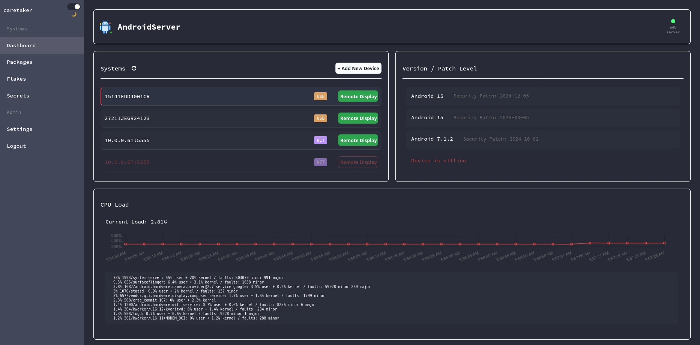

# dashdroid

<p align="center">
  <strong>Documentation:</strong>
  <a href="./docs/main.md">Markdown</a>
  •
  <a href="./CHANGELOG.md">Changelog</a>
</p>
<p align="center">
  <!--  -->
  
</p>

Web dashboard to manage ADB enabled Android devices.

### Alpha Project! There will be bugs

## Install

Only tested on Linux `X11` currently Wayland support close behind. The only command I see failing on local Mac or Windows installs is when calling remote display commands. I'm currently using `wmctrl` to query window titles and raise an alert rather than spawning a new window if a remote display for that device is active already.

### Dependencies
If you are running locally without Docker or MicroVM you must install the following dependencies:
- `adb`
- `fastboot`
- `scrcpy`
- `wmctrl`

Optional:
- `ssh` - If you decide to install Termux or nix-on-droid

<mark>Note:</mark> When installing `scrcpy` most package managers have outdated versions and remote display will fail on newer devices. See the [install script](https://github.com/noflcl/dashdroid/blob/main/download_scrcpy.sh) I use for the Docker build for a reference of how I install the latest build on Ubuntu. Or check out the projects install docs for [linux](https://github.com/Genymobile/scrcpy/blob/master/doc/linux.md), [mac](https://github.com/Genymobile/scrcpy/blob/master/doc/macos.md), and [windows](https://github.com/Genymobile/scrcpy/blob/master/doc/windows.md).

## Start

To run the dashboard first enter the `app` directory and install the Node dependencies.

- `npm install` to install dependencies

Now you can run the dashboard in its early Alpha stages.

- `npm run dev` to start the dashboard

## Docker

Current base image is Ubuntu 22.04, build with Docker and run the dashboard locally.

- `docker build -t dashdroid:latest .` to build the image

- Run the image or use the supplied compose file

<mark>Note:</mark> I have yet to overwrite my adb keys with this project, I suggest backing your local keys up (If you have any).

```
docker run \
  --name dashdroid \
  --restart unless-stopped \
  --privileged \
  -v ./settings.cfg:/app/settings.cfg \
  -v /path/to/adb/keys/.android:/root/.android:rw \
  -v /dev/bus/usb:/dev/bus/usb:ro \
  -v /tmp/.X11-unix:/tmp/.X11-unix:ro \
  -v /run/user/1000/pulse:/run/user/1000/pulse \
  -p 3000:3000 \
  -e NODE_ENV=development \
  -e DISPLAY=${DISPLAY} \
  -e QT_X11_NO_MITSHM=1 \
  -e PULSE_SERVER=unix:/run/user/1000/pulse/native \
  -e SDL_AUDIODRIVER=pulseaudio \
  dashdroid
```

## MicroVM

If using `Nix` or `NixOS` you need flakes enabled, default virtual machine is `qemu` easily change with your choice of [supported hypervisor]("https://github.com/astro/microvm.nix#hypervisors").

- `nix run .#dashdroid` to build and run dashdroid with MicroVM

There are more ways of using the project with Nix / NixOS. View the documentation [here](docs/nixos.md) for more examples.

## ToDo

Almost to many to list, this is early days

  - [ ] GPU monitoring
    - Commands differ depending on devices (create general solution)
  - [ ] SSH isn't flushed out and I want to enable it from the dashboard
  - [ ] Screen recording for demos
  - [ ] Video / Audio codec selection support per device
  - [ ] Mic and Camera features

